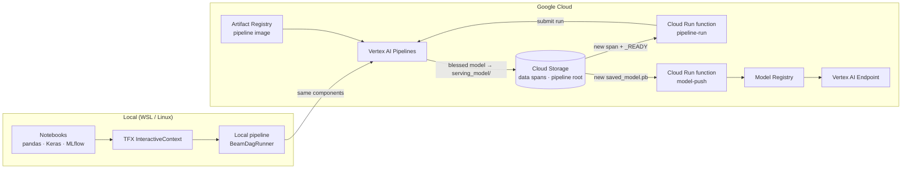

# Production-Grade Deep Learning Pipelines with TFX and Vertex AI


Companion code for the course **Production-Grade Deep Learning Pipelines**. You take one deep learning model from a notebook to a self-retraining production system on Google Cloud: experiment locally, rebuild the workflow as a TFX pipeline, run it on Vertex AI Pipelines, serve it from a Vertex AI Endpoint, and retrain automatically when new data arrives.

**Case study:** predicting concrete compressive strength (MPa) from eight mix-design features, using the UCI Concrete Compressive Strength dataset (Yeh, 1998).

---

## Contents

- [Architecture](#architecture)
- [Repository structure](#repository-structure)
- [Course map](#course-map)
- [Prerequisites](#prerequisites)
- [Setup](#setup)
- [Get the data](#get-the-data)
- [Stage 1 – Experimentation](#stage-1--experimentation)
- [Stage 2 – Local TFX pipeline](#stage-2--local-tfx-pipeline)
- [Stage 3 – Cloud pipeline on Vertex AI](#stage-3--cloud-pipeline-on-vertex-ai)
- [Stage 4 – Event-driven deployment and retraining](#stage-4--event-driven-deployment-and-retraining)
- [Configuration reference](#configuration-reference)
- [Cost and clean-up](#cost-and-clean-up)
- [Dataset and citation](#dataset-and-citation)

---

## Architecture



The pipeline is the same set of TFX components at every stage — **ExampleGen → StatisticsGen → SchemaGen → ExampleValidator → Transform → Tuner → Trainer → Resolver + Evaluator → Pusher** — only the orchestrator and storage change.

A new model reaches the endpoint only if the Evaluator blesses it:

| Metric | Absolute threshold | Must also beat the current model by |
| --- | --- | --- |
| Mean Absolute Error | < 10.0 MPa | ≥ 0.1 |
| Root Mean Squared Error | < 15.0 MPa | ≥ 0.1 |

---

## Repository structure

```text
.
├── 01_experimentation/          # Modules 1–4: notebooks + TFX InteractiveContext
│   ├── 1_data_ingest.ipynb      #   split the dataset into spans and train/eval/test
│   ├── 2_feature_eng.ipynb      #   EDA and standardization
│   ├── 3_model_arch.ipynb       #   Keras DNN, callbacks, MLflow tracking, SavedModel
│   ├── 4_tfx_pipeline.ipynb     #   every TFX component, one cell at a time
│   ├── module.py                #   preprocessing_fn, tuner_fn, run_fn
│   └── exp_data/                #   created by prepare_data.py
├── 02_local_pipeline/           # Module 5: the same components as one local pipeline
│   ├── base_pipeline.py         #   init_components(): builds the component graph
│   ├── pipeline_run.py          #   runs it with BeamDagRunner + SQLite metadata
│   ├── setup_logging.py
│   ├── module.py
│   └── loc_dev_data/            #   created by prepare_data.py
├── 03_cloud_pipeline/           # Modules 6–9: Vertex AI Pipelines
│   ├── .github/workflows/
│   │   └── submit-vertex.yml    #   CI/CD: compile + submit on push (Module 9)
│   ├── base_pipeline.py         #   training window (latest 3 spans) + eval window (latest span)
│   ├── pipeline_run.py          #   compile to pipeline.json, stage wheels, submit
│   ├── Dockerfile               #   pipeline image (TFX 1.15.1 stack)
│   ├── requirements.txt
│   ├── req.json                 #   sample online-prediction request (serve_json)
│   ├── pipeline.json            #   example compiled pipeline spec
│   └── bucket_data/data/        #   created by prepare_data.py: span-1..3 as in gs://<bucket>/data/
├── 04_cloud_run_functions/      # Modules 8–9: event-driven automation
│   ├── gcp_cloud_run_func_pp-run.py       # new span → submit pipeline run
│   └── gcp_cloud_run_func_model-push.py   # new SavedModel → register + deploy
├── docs/                        # setup guide and lab notes
├── prepare_data.py              # builds all data folders from the UCI source file
└── requirements.txt             # full local environment (pinned)
```

---

## Course map

| Module | Topic | Folder |
| --- | --- | --- |
| 1 | Introduction, ML lifecycle, MLOps maturity, case study, local setup | [`docs/`](docs/) |
| 2 | Data ingestion, spans, EDA, feature engineering | [`01_experimentation/`](01_experimentation/) |
| 3 | DNN design, training, MLflow experiment tracking | [`01_experimentation/`](01_experimentation/) |
| 4 | TFX components with `InteractiveContext` | [`01_experimentation/`](01_experimentation/) |
| 5 | Local orchestration and artifact caching | [`02_local_pipeline/`](02_local_pipeline/) |
| 6 | GCP project, IAM, Cloud Storage | [`03_cloud_pipeline/`](03_cloud_pipeline/) |
| 7 | Vertex AI Pipelines: compile, containerize, submit | [`03_cloud_pipeline/`](03_cloud_pipeline/) |
| 8 | Model Registry, Endpoints, automatic deployment | [`03_cloud_pipeline/`](03_cloud_pipeline/), [`04_cloud_run_functions/`](04_cloud_run_functions/) |
| 9 | Monitoring, event-driven retraining, CI/CD with GitHub Actions | [`04_cloud_run_functions/`](04_cloud_run_functions/) |
| 10 | Advanced patterns, cost, team practices | — |

---

## Prerequisites

- **Linux or WSL 2.** TFX has no native Windows build. Windows users: follow [`docs/setup-wsl.md`](docs/setup-wsl.md) first.
- **Python 3.10** (Ubuntu 22.04 ships it).
- **VS Code** with the Python, Jupyter and (on Windows) WSL extensions.
- **For Stages 3–4:** a Google Cloud project with billing enabled, the [Google Cloud CLI](https://cloud.google.com/sdk/docs/install), and Docker.

---

## Setup

```bash
git clone https://github.com/real-ahmed-moussa/pdlp
cd production-grade-dl-pipelines

python3.10 -m venv ~/tfx_venv
source ~/tfx_venv/bin/activate
python -m pip install --upgrade pip
pip install -r requirements.txt
```

Check the install:

```bash
python -c "import tfx, tensorflow as tf; print('TFX', tfx.__version__, '| TF', tf.__version__)"
# TFX 1.15.1 | TF 2.15.1
```

---

## Get the data

The dataset is not stored in this repository. Download it from the source and let `prepare_data.py` build every data folder the course uses:

1. Download the dataset from the [UCI Machine Learning Repository](https://archive.ics.uci.edu/dataset/165/concrete+compressive+strength).
2. Unzip it and copy `Concrete_Data.xls` into the repository root.
3. Run:

   ```bash
   pip install xlrd          # lets pandas read .xls files
   python prepare_data.py
   ```

The script renames the columns to the short names used in the course (`cement, bfs, fa, water, sp, ca, fa.1, age, c_str`) and applies exactly the same splits as `1_data_ingest.ipynb` (`random_state=42`). It writes:

| Folder | Contents |
| --- | --- |
| `01_experimentation/exp_data/` | `original_data.csv`, Span 1 and Span 2, each split into train/eval/test |
| `02_local_pipeline/loc_dev_data/` | Span 1 split into train/eval/test |
| `03_cloud_pipeline/bucket_data/data/` | `span-1` to `span-3` in the bucket layout (`train/`, `val/`, `test/`); spans 2 and 3 carry the `_READY` marker |

> The data in the recorded videos was prepared from the same source with values rounded to fewer decimal places, so individual numbers in your outputs can differ slightly from what you see on screen. The pipeline, splits and results behave the same way.

---

## Stage 1 – Experimentation

```bash
cd 01_experimentation
mlflow server --host 127.0.0.1 --port 5000   # keep running in a second terminal
```

Open the notebooks in order in VS Code and select the `tfx_venv` kernel:

1. **`1_data_ingest.ipynb`** reads `exp_data/original_data.csv` (created by `prepare_data.py`), splits it 50/50 into Span 1 and Span 2, then 70/15/15 into train/eval/test. Span 2 is held back to simulate new production data in Module 9.
2. **`2_feature_eng.ipynb`** explores Span 1 and fits the standard scaler on the training split only.
3. **`3_model_arch.ipynb`** builds and trains the DNN, logs runs to MLflow at `http://127.0.0.1:5000`, and saves a SavedModel.
4. **`4_tfx_pipeline.ipynb`** runs each TFX component interactively, using `module.py` for Transform, Tuner and Trainer.

---

## Stage 2 – Local TFX pipeline

```bash
cd 02_local_pipeline
python pipeline_run.py
```

The run writes everything under `02_local_pipeline/output/`:

- `ppln_root/` – component artifacts and `metadata.sqlite` (ML Metadata)
- `serving_model/` – the pushed, blessed model
- `logs/` – application and full logs

On the first run SchemaGen infers the schema and the script exports it to `ppln_root/schema/schema.pbtxt`; later runs import that file instead (the conditional schema pattern from Module 4).

---

## Stage 3 – Cloud pipeline on Vertex AI

1. **Configure.** Set `PROJECT_ID`, `REGION`, `BUCKET` and `DEFAULT_IMAGE` at the top of `03_cloud_pipeline/pipeline_run.py` (see [Configuration reference](#configuration-reference)).
2. **Upload the first span** so the bucket matches `gs://<bucket>/data/span-1/{train,val,test}/`:

   ```bash
   gcloud storage cp -r 03_cloud_pipeline/bucket_data/data/span-1 gs://<bucket>/data/
   ```

3. **Build and push the pipeline image** to Artifact Registry:

   ```bash
   cd 03_cloud_pipeline
   gcloud auth configure-docker <region>-docker.pkg.dev
   docker build -t <region>-docker.pkg.dev/<project-id>/<repo>/tfx-pipeline:latest .
   docker push <region>-docker.pkg.dev/<project-id>/<repo>/tfx-pipeline:latest
   ```

4. **Compile and submit:**

   ```bash
   python pipeline_run.py
   ```

   This compiles the pipeline to `pipeline.json`, uploads the user-code wheels to the bucket, submits the run to Vertex AI Pipelines, and uploads `pipeline.json` to `gs://<bucket>/pipeline.json` for the retraining function to reuse.

5. **Serve.** Register the pushed model in the Model Registry, deploy it to an endpoint, and send `req.json` as an online prediction request (signature `serve_json`).

The cloud pipeline reads two windows that it rebuilds on every run: the **training window** (`data/_window_train/`, the latest 3 complete spans) and the **evaluation window** (`data/_window_eval/`, the latest span).

---

## Stage 4 – Event-driven deployment and retraining

Both functions are Cloud Run functions (Python, CloudEvent) triggered by Cloud Storage object-finalized events on your bucket.

| Function | Entry point | Fires on | Does |
| --- | --- | --- | --- |
| `gcp_cloud_run_func_pp-run.py` | `trigger_pipeline` | `data/span-N/_READY` | Locks the span, checks `train/`, `val/` and `test/` exist, rebuilds both windows, submits `pipeline.json` |
| `gcp_cloud_run_func_model-push.py` | `deploy_to_vertex` | `serving_model/<version>/saved_model.pb` | Checks the SavedModel is complete, locks the version, registers it under the parent model, deploys it to the endpoint |

**Simulate new production data.** Upload Span 2 *with* its `_READY` marker:

```bash
gcloud storage cp -r 03_cloud_pipeline/bucket_data/data/span-2 gs://<bucket>/data/
```

The marker triggers a retraining run. If the new model passes the Evaluator gate, Pusher writes it to `serving_model/` and the model-push function deploys it. Span 3 is an exact copy of Span 2, kept as a demo span for triggering a second retraining run.

> **Lessons vs labs.** The Module 9 lessons describe retraining triggered by a Vertex AI Model Monitoring drift alert (Monitoring → Pub/Sub → Cloud Run function). The labs trigger the same function on a new data span, because a real drift alert needs days of live traffic. See [`docs/module-9-lab-note.md`](docs/module-9-lab-note.md).

**CI/CD.** `03_cloud_pipeline/.github/workflows/submit-vertex.yml` compiles and submits the pipeline whenever `base_pipeline.py`, `module.py`, `pipeline_run.py`, `setup_logging.py` or the workflow itself changes on `main` (or when run manually). It authenticates through Workload Identity Federation (no JSON keys), installs the pinned TFX stack, waits for the run to finish, and runs in a `vertex-prod` environment so you can require a reviewer's approval before each submission.

As in the Module 9 labs, the workflow is meant for a repository whose root is the contents of `03_cloud_pipeline/`. GitHub only runs workflows from a repository's root `.github/workflows/` folder, so it stays inactive inside this course repository. To use it:

1. Create a new GitHub repository and copy the contents of `03_cloud_pipeline/` (including `.github/`) to its root.
2. Add two repository secrets: `WIF_PROVIDER` (your Workload Identity Provider resource name) and `GCP_SA_EMAIL` (the service account it impersonates).
3. Create an environment named `vertex-prod` under **Settings → Environments** and add required reviewers if you want an approval gate.
4. Replace `your-gcp-project-id` in the workflow with your project ID.

---

## Configuration reference

Placeholders to replace with your own values before running Stages 3–4:

| File | Setting | Example |
| --- | --- | --- |
| `03_cloud_pipeline/pipeline_run.py` | `PROJECT_ID`, `REGION`, `BUCKET`, `DEFAULT_IMAGE` | `your-gcp-project-id`, `us-central1`, `tfx-buck` |
| `03_cloud_pipeline/base_pipeline.py` | default `bucket` in `build_window()` | `tfx-buck` |
| `04_cloud_run_functions/gcp_cloud_run_func_pp-run.py` | `PROJECT_ID`, `LOCATION`, `PIPELINE_TEMPLATE_URI`, `PIPELINE_ROOT`, `PIPELINE_SA` | `gs://<bucket>/pipeline.json` |
| `03_cloud_pipeline/.github/workflows/submit-vertex.yml` | `project_id`, `CLOUDSDK_CORE_PROJECT` | `your-gcp-project-id` |
| `04_cloud_run_functions/gcp_cloud_run_func_model-push.py` | `PROJECT_ID`, `LOCATION`, `ENDPOINT_ID`, `PARENT_MODEL_ID`, `MACHINE_TYPE` | IDs from your Model Registry and Endpoint |

Bucket names are global across Google Cloud, so choose your own.

---

## Cost and clean-up

Vertex AI Pipelines, Endpoints and Artifact Registry are billed while in use; a deployed endpoint is billed for as long as a model is deployed to it. When you finish a lab:

- undeploy models from the endpoint and delete the endpoint,
- delete old pipeline runs and artifacts you no longer need from the bucket,
- remove unused images from Artifact Registry.

---

## Dataset and citation

The dataset is not redistributed here; `prepare_data.py` builds the course data from the original file.

Yeh, I. (1998). *Concrete Compressive Strength* [Dataset]. UCI Machine Learning Repository. https://doi.org/10.24432/C5PK67 — licensed under [CC BY 4.0](https://creativecommons.org/licenses/by/4.0/).

1,030 samples; eight inputs (cement, blast-furnace slag, fly ash, water, superplasticizer, coarse aggregate, fine aggregate, age) and one target, compressive strength `c_str` in MPa.

---

## Author

**Dr. Ahmed Moussa** — [dr-moussa.net](https://dr-moussa.net)
